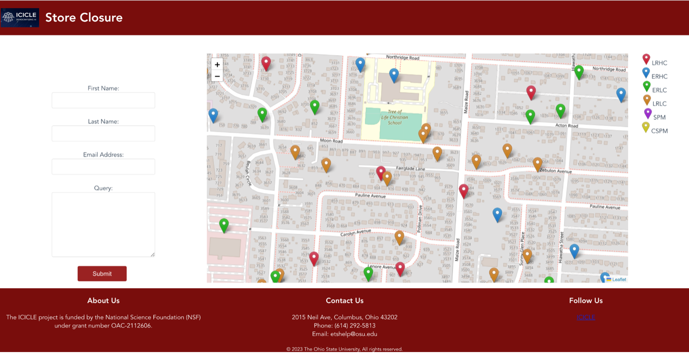
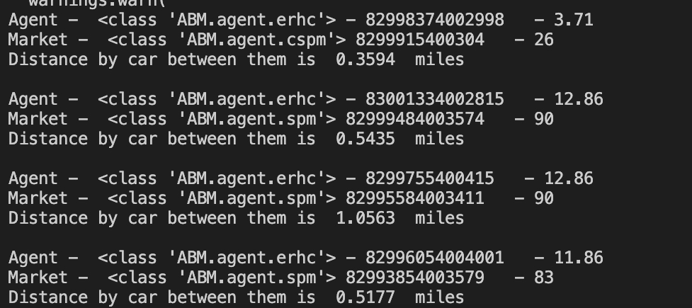

# Store_Closure_Website (Version 1)
## Introduction

This website provides users with an engaging and interactive platform to explore an agent-based model. The model allows for dynamic simulations and captures the complex interactions between different types of households and markets. By utilizing this model, users can gain valuable insights into the food insecurity levels experienced by various types of households. 



The agent based model is based on the following papers

 - [Koh, K., Reno, R., & Hyder, A. (2018). Designing an agent-based model using group model building: Application to food insecurity patterns in a US midwestern metropolitan city. Journal of Urban Health, 95, 278-289.](https://link.springer.com/article/10.1007/s11524-018-0230-1)
 - [Koh, K., Reno, R., & Hyder, A. (2019). Examining disparities in food accessibility among households in Columbus, Ohio: an agent-based model. Food Security, 11, 317-331.](https://link.springer.com/article/10.1007/s12571-019-00900-7)


## Deployment

Please download the following file and add it to **./ABM/data/** 

https://drive.google.com/file/d/1ev2gF3WzQQiEIYtGiQIuQsX5hln0MOSp/view?usp=sharing 

### Without Docker Container

```
You will need to install PostgreSQL to your machine.

* Set up PostgreSQL in you local machine.
* Create a database named "mydatabase"
* Change "Databases" configuration in the settings.py file according to your machine.
```

Then do the following steps.
```
> git clone https://github.com/Harshpanday/Store_Closure_Website.git

> pip install -r requirements.txt

> Run the load_initial_data.py inside scripts folder (if running for the 1st time)

> python manage.py runserver

> Add "/vue-test" in front of the localhost address to access the website's frontend.
```
### With Docker
Make sure you have docker compose installed.
Then simply run
```
> docker compose up

```
This will run the frontend, backend, and database containers.
To query the Converstational AI model, you will need an internet connection.


## Usage
The primary purpose of this website is to empower users to run the agent-based model and obtain an  analysis of how their queries impact the food insecurity levels of different households.

In order to run the agent based model deploy the website 


Once you see the above page, enter your First Name, Last Name, Email Address, Query and press submit.

Once you press submit the agent based model will start the simulation in the background 



All this collected data will be used for analysis.


## Acknowledgements
This work has been funded by grants from the National Science Foundation, including the ICICLE AI Institute (OAC 2112606)
